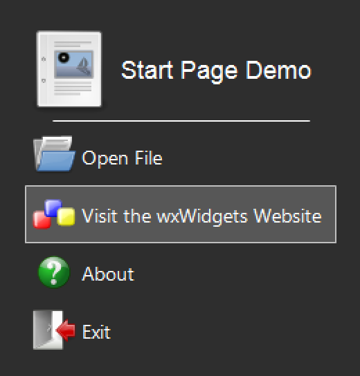

wxStartPage
=============================


About
=============================

A [wxWidgets](https://github.com/wxWidgets/wxWidgets) landing page for an application.

It displays a most-recently-used file list on the right side (up to 9 files) and a list of
customizable buttons on the left.

- Users clicking on these buttons can be handled via a `wxEVT_STARTPAGE_CLICKED` event.
- Modified dates are shown next to each file in the MRU list.\n
  These dates are shown in a human readable format (e.g., "Just now", "12 minutes ago",
  "Yesterday", "Tues at 1:07 PM").
- Human readable file paths are shown below the files (e.g., "Documents » Invoices")
- Includes a "Clear file list" button beneath the MRU list.
- The application name & logo can be shown above the custom buttons.
- A dynamic greeting is shown above the MRU list (which is also customizable).
- Customizable theming.
- Supports dark mode.
- Supports HiDPI displays.

Dark theme:


Button hover effect:



Button hover 3D effect:


Building
=============================

Download the repository:

```
git clone https://github.com/Blake-Madden/wxStartPage.git
```

Then, include `startpage.h` and `startpage.cpp` in your project.

To build the demo, build `demo/CMakeLists.txt` with CMake and your compiler of choice.

Documentation
-----------------------------

To build the API documentation, open `Doxyfile` in Doxygen and run it.

Dependencies
=============================

- [wxWidgets](https://github.com/wxWidgets/wxWidgets) 3.2 or higher
- A C++14 compatible compiler